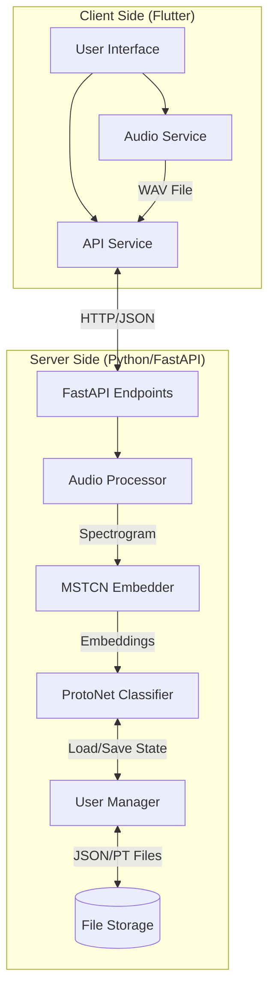
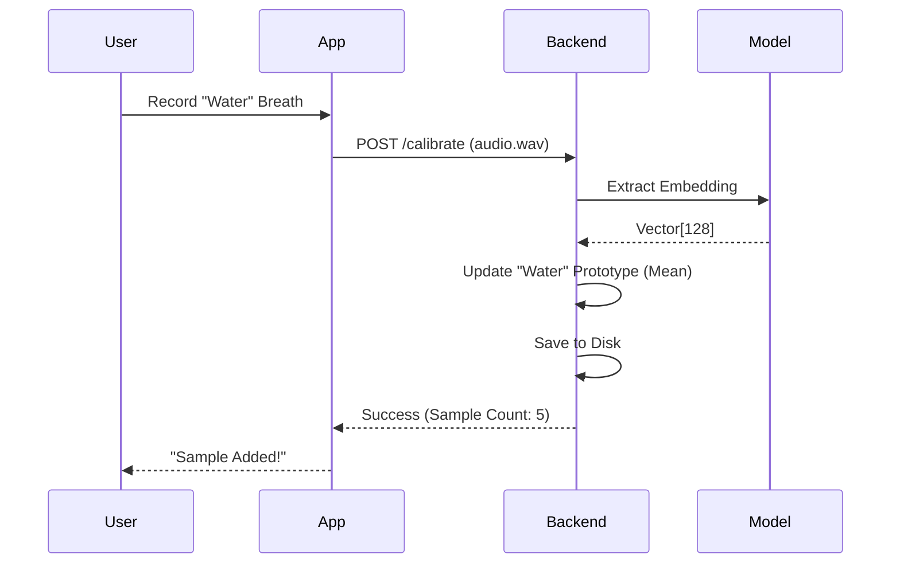
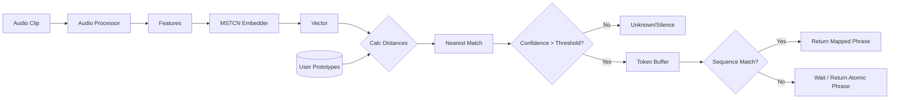

# MURMUR Codebase Documentation

## 1. Project Overview
**MURMUR** is an AI-powered Augmentative and Alternative Communication (AAC) system designed to recognize personalized breath patterns and translate them into speech or commands. It uses Few-Shot Learning (Prototypical Networks) to allow users to calibrate their own breath signals (e.g., "short breath", "long breath", "double breath") and map them to specific intents or phrases.

The system consists of:
1.  **Mobile App (Flutter)**: The user interface for calibration, configuration, and active listening.
2.  **Backend Server (Python/FastAPI)**: The core AI engine that processes audio, manages user models, and performs inference.

---

## 2. System Architecture

The system follows a typical Client-Server architecture where the heavy ML processing is offloaded to the backend.

### Key Components

#### Backend (`backend_server/`)
-   **`main.py`**: The entry point for the FastAPI server. Handles HTTP requests for calibration, prediction, and user management.
-   **`protonet.py`**: Implements the **Prototypical Network**. It stores "prototypes" (mean embeddings) for each intent class per user. It performs classification by calculating the Euclidean or Cosine distance between the input audio's embedding and the stored prototypes.
-   **`model.py` / `MSTCNEmbedder`**: Wraps the MS-TCN (Multi-Stage Temporal Convolutional Network) model used to extract rich feature embeddings from raw audio/spectrograms.
-   **`audio_processor.py`**: Handles audio loading, silence removal/breath detection, and windowing (slicing long audio into chunks).
-   **`user_manager.py`**: Manages the persistence of user data. User prototypes and configurations are saved to disk (`user_data/`) so the model state survives restarts.

#### Mobile App (`mobile_app/`)
-   **`services/api_service.dart`**: Handles all network communication with the backend.
-   **`screens/home_screen.dart`**: Main dashboard for navigating between calibration and listening modes.
-   **`screens/calibration_screen.dart`**: UI for recording samples to "teach" the model new breath signals (intents).
-   **`screens/listening_screen.dart`**: The active mode where the app continuously streams (or periodically sends) audio to the backend to detect user input.

---

## 3. Data Flow

### 3.1. Calibration Flow (Teaching the Model)
When a user wants to add a new breath signal (e.g., "Water"):

1.  **Record**: User adds a sample in `CalibrationScreen`. `AudioService` records a WAV file.
2.  **Upload**: `ApiService` sends `POST /calibrate/{user_id}/{intent}` with the audio file.
3.  **Process**:
    -   Backend receives audio.
    -   `AudioProcessor` validates audio and detects breath.
    -   `MSTCNEmbedder` converts the audio into a high-dimensional vector (embedding).
4.  **Update Prototype**:
    -   `ProtoNet` adds the new embedding to the user's list of samples for "Water".
    -   It recalculates the "Prototype" (mean) for "Water".
5.  **Persist**: `UserManager` saves the updated prototypes to disk.
6.  **Response**: Backend returns the new sample count.

### 3.2. Prediction Flow (Active Listening)
When the user breathes into the app to trigger a command:

1.  **Capture**: `ListeningScreen` captures a clip of audio.
2.  **Request**: `ApiService` sends `POST /predict/{user_id}`.
3.  **Inference**:
    -   `MSTCNEmbedder` generates an embedding for the input.
    -   `ProtoNet` calculates distances to ALL of the user's calibrated prototypes.
    -   **Confidence Check**: If the distance to the nearest prototype is within a threshold (and significantly closer than the second best), it is a match.
4.  **Sequence Handling**:
    -   If the match is atomic (e.g., "Short"), the backend checks if this helps form a sequence (e.g., "Short, Long").
    -   It buffers the token. If "Short, Long" maps to "Help", and the buffer matches, the phrase is returned.
5.  **Response**: Backend returns the detected intent ("Water"), the phrase ("I need water"), and confidence metrics.
6.  **Feedback**: App plays TTS or shows the recognized phrase.

---

## 4. detailed Implementation Notes

### The Few-Shot Learning Approach
The core innovation here is the use of **Prototypical Networks**. Deep learning models usually require thousands of samples. By using a pre-trained embedding model (`MSTCN`), Murmur projects audio into a space where similar sounds are close together.
-   **Class Representation**: A class (Intent) is represented strictly by the *center point* (prototype) of its support samples.
-   **Metric Learning**: Classification is simply "Who is my nearest neighbor?" in this embedding space.
-   **Benefits**:
    -   **Fast Calibration**: Requires only 3-5 samples to work effectively.
    -   **Personalization**: Every user has their own completely unique classification boundary.
    -   **Open-Ended**: Users can define *any* sound as an intent, as long as it's consistent.

### Sequence Mapping logic
The backend (`main.py`) contains a stateful buffer for each user.
-   **Atomic Intents**: Basic signals like "Short Breath", "Long Breath".
-   **Sequences**: Combinations like "Short, Short, Long".
-   **Algorithm**:
    1.  Incoming prediction is "Short".
    2.  Append to buffer: `["Short"]`.
    3.  Check if `["Short"]` is a valid sequence. If yes -> Trigger.
    4.  Check if `["Short"]` is a *prefix* of a longer valid sequence (e.g. `["Short", "Long"]`).
    5.  If it is a prefix, wait (return silence).
    6.  If not a prefix and not a match, return the atomic phrase for "Short".

### API Structure
-   **RESTful**: The API is stateless regarding the connection, but stateful regarding the user's data (persisted on disk).
-   **Polymorphic Response**: The `/predict` endpoint returns detailed debug info (`all_distances`) which allows the frontend to show a live "confidence meter" or debug visualizer.

## 5. Technology Stack

| Component | Technology | Role |
|-----------|------------|------|
| **Backend** | Python 3.9+ | Runtime environment |
| **Server** | FastAPI | High-performance Async Web Framework |
| **ML Engine** | PyTorch | Tensor computation and Model inference |
| **Audio** | Librosa / Torchaudio | Audio processing and feature extraction |
| **Mobile** | Flutter | Cross-platform functional UI |
| **Network** | HTTP (Multipart/Form-Data) | Audio transmission |

